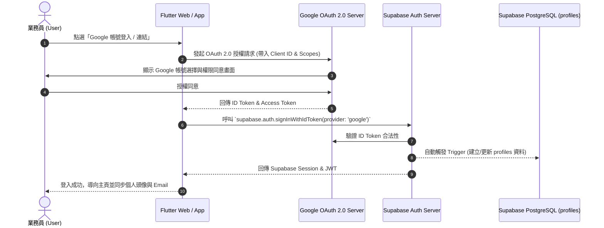
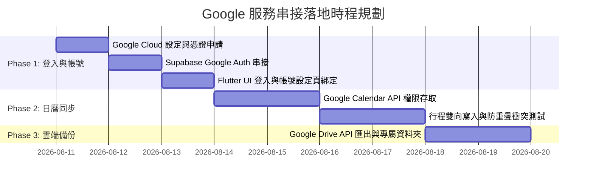

# 📘 Google 帳號與服務整合開發說明書 (Google Services Integration Blueprint)

> **文件版本**：v1.0  
> **建立日期**：2026-08-10  
> **適用專案**：`insurance_helper` (保險經紀人智慧助理)  
> **對齊規格**：[主系統規格書](main_spec.md) | [專案進度表](../進度.md)

---

## 🎯 1. 專案背景與整合目標

在保險業務員的日常工作場景中，Google 生態系（包含 Google 帳號登入、Google Calendar 日曆、Google Drive 雲端硬碟與 Google Maps 地圖）是極為關鍵的生產力工具。

本專案引進 Google 服務串接，旨在達成以下 4 大核心目標：
1. **無縫登入 (Zero-Friction Auth)**：透過 Google OAuth 2.0 實現業務員一鍵登入與帳號綁定，降低註冊門檻與忘記密碼成本。
2. **行程雙向對齊 (Calendar Sync)**：將 App 中的拜訪排程與跟進提醒自動寫入業務員個人 Google 日曆，並讀取 Google 日曆空閒時段，防止排程重疊衝突。
3. **安全雲端備份 (Cloud Backup & Export)**：讓業務員能將電子名片 (vCard)、客戶資料備份及 PDF 報表一鍵匯出至其個人 Google Drive 專屬資料夾。
4. **地理智慧與導航 (Location Intelligence)**：整合 Google 地圖導航與地址定位，優化外訪路徑。

---

## 🧩 2. 五大 Google 核心服務與功能規劃矩陣

| Google 服務 / API | 專案應用場景 | OAuth Scope 權限需求 | 優先級 |
| :--- | :--- | :--- | :--- |
| **Google OAuth 2.0 / Identity** | 業務員第三方登入、註冊與帳號切換/綁定 | `openid`<br>`email`<br>`profile` | 🔥 **Phase 1 (最高)** |
| **Google Calendar API v3** | 1. 拜訪行程 (`schedule_events`) 雙向同步<br>2. 讀取 Google 日曆空暇時間（客戶線上預約防衝突） | `.../auth/calendar.events`<br>`.../auth/calendar.readonly` | 🚀 **Phase 2** |
| **Google Drive API v3** | 1. 客戶資料備份 (CSV/JSON)<br>2. 電子名片 (.vcf) 與 PDF 報表匯出至專屬資料夾 | `.../auth/drive.file`<br>*(僅存取本 App 建立之檔案)* | 📦 **Phase 3** |
| **Google Maps & Places API** | 1. 客戶卡片地址一鍵導航<br>2. 地址經緯度轉換 (Geocoding) 與拜訪路線規劃 | 無需 OAuth (採用 API Key 控制) | 🗺️ **Phase 4** |
| **Google Gemini AI API** | 1. 實體名片照片 OCR 智慧識別<br>2. Groq Edge Function 之雙軌 AI 備援 Engine | 無需 OAuth (採用 API Key / Vertex AI) | 🤖 **Phase 4** |

---

## 🏗️ 3. 系統架構與 Auth 認證資料流

本專案選用 **Supabase Auth** 作為中央身分驗證託管平台，Google 認證流程採 **OAuth 2.0 PKCE / ID Token Flow**：



---

## 🛠️ 4. Google Cloud Console 設定與 SOP 步驟

為落實在本地與正式環境的串接，需在 **Google Cloud Console** 完成以下 5 大設定步驟：

### Step 1: 建立 Google Cloud 專案
- 專案名稱：`insurance-helper-prod`
- 專案 ID：`insurance-helper-auth`

### Step 2: 配置 OAuth 同意畫面 (OAuth Consent Screen)
- **User Type**：外部 (External)
- **應用程式名稱**：`保險經紀人智慧助理 (Insurance Helper)`
- **使用者支援電子郵件**：專案開發者 Email
- **已授權網域**：
  - `supabase.co` (Supabase 驗證網域)
  - `vercel.app` (靜態託管網域)

### Step 3: 申請 3 種 Client ID 憑證 (Credentials)
1. **Web Client ID**（適用於 Web 測試版與 Supabase 後端通訊）：
   - 已授權的 JavaScript 來源：`http://localhost:8080`, `https://<your-supabase-id>.supabase.co`
   - 已授權的重導向 URI：`https://<your-supabase-id>.supabase.co/auth/v1/callback`
2. **Android Client ID**（適用於 Android App，需設定 Package Name 與 SHA-1 指紋）
3. **iOS Client ID**（適用於 iOS App，需設定 iOS Bundle ID）

### Step 4: 在 Supabase Dashboard 配置 Provider
- 路徑：`Authentication` -> `Providers` -> `Google`
- 開啟 `Enable Google Provider`
- 貼入 **Client ID** 與 **Client Secret**
- 複製 Supabase 提供的 `Callback URL` 貼回 Google Cloud Console。

### Step 5: 啟動對應 API 服務
在 Google Cloud 服務中啟動以下 API：
- `Google Calendar API`
- `Google Drive API`
- `Google Maps JavaScript API`

---

## 📦 5. Flutter 專案相依套件與工具包預計變更

依據 [工具包維護規範](../工具包.md)，準備導入之 Dart 套件如下：

```yaml
dependencies:
  google_sign_in: ^6.2.1        # 跨平台 Google 第三方登入 SDK
  googleapis: ^13.2.0           # 存取 Google Calendar & Drive API 之官方 SDK
  extension_google_sign_in_as_googleapis_auth: ^2.0.12 # 銜接 Sign-In 憑證至 API Client
```

---

## 🚀 6. 分階段實作路線圖 (Implementation Roadmap)



---

## 📌 7. 資安與資產保護 SOP (Security & Privacy Compliance)

1. **Token 安全儲存**：Google Provider Access Token 與 Refresh Token 嚴禁硬編碼 (Hardcode) 在前端或提交至 Git 倉庫；一律透過 Supabase Auth Session 持久化儲存。
2. **最小權限原則 (Least Privilege)**：
   - Google Drive API **嚴禁申請 `drive` 全區讀寫權限**，必須使用 `drive.file` (僅能讀寫本 App 產生的檔案)。
   - 日曆權限限制在 `calendar.events` 範圍。
3. **`.env` 環境變數隔離**：Google OAuth Client Secret 與 API Keys 一律寫入 `.env` 與 Vercel / GitHub Secrets。

---
*本說明書將隨開發進度持續更新，最新版本以 [docs/00_公共規格/Google帳號與服務整合開發說明書.md](Google帳號與服務整合開發說明書.md) 為準。*
