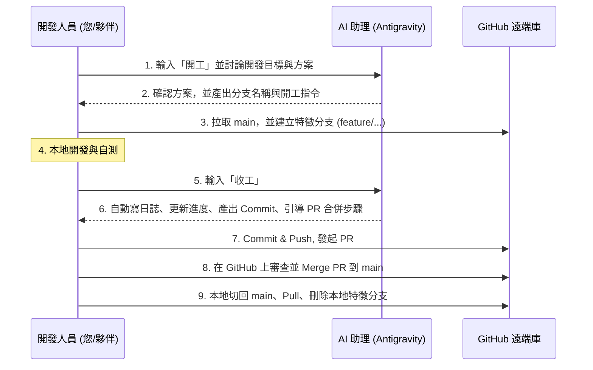
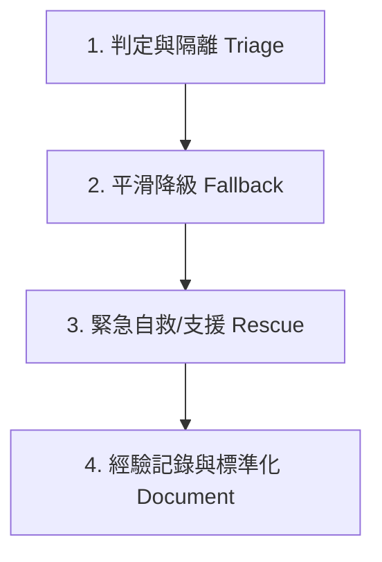

# 保險客戶管理小工具 (insurance_helper) 開發人員手冊 & 危機自救手冊

本手冊為專案開發成員（蘿蔔與巨獸）的日常開發指南與危機應變 SOP。旨在讓所有專案人員不論在日常開發、程式碼提交、金鑰安全保存，或是遇到突發系統危機（如 Token 耗盡、裝置故障）時，都能快速找到指引並實現自救。

---

## 🎨 1. 日常開發與「收工」操作流程 (Git 協作指引)

為確保專案程式碼的穩定性，並避免多人同時修改同一檔案造成嚴重的衝突（Merge Conflicts），本專案採用 **AI 輔助的分支協作模式**。整個開發週期的生命週期如下圖所示：



---

### 🔄 階段一：開工前（對 AI 輸入「開工」取得分支引導與防呆）

1. **對 AI 輸入「開工」**：在準備開始寫程式前，請在聊天視窗中對 AI 助理輸入「**開工**」。
2. **AI 主動引導與確認**：
   - **確認身分**：AI 助理會主動詢問您今天是 **蘿蔔 (lobo)** 還是 **巨獸 (beast)**，以產生正確的分支首碼與工作區路徑。
   - **進度對齊**：AI 會自動讀取並展示 [進度.md](file:///c:/Users/USER/Documents/GitHub/project67/docs/進度.md) 中的當前 Todo / In Progress 項目，協助您確認本次要進行的任務。
3. **取得建議分支名稱**：AI 會為您計算出符合規範的**分支名稱**（格式如 `feature/username-featurename`）。
4. **安全開工操作**：


#### 📌 具體開工操作：

##### 💻 GitHub Desktop 操作：
1. 開啟 GitHub Desktop，確認目前專案（Current Repository）為 `project67`。
2. 點擊頂部的 **Current Branch**，切換回 `main`（或專案的主開發分支）。
   > [!WARNING]
   > 若點擊切換時提示有未提交的變更，請先選擇 **Bring my changes**（將變更攜置新分支）或先進行暫存/提交，避免程式碼被覆蓋。
3. 點擊 **Fetch origin**（如果有新變更，按鈕會變成 **Pull origin**，點擊它以拉取最新進度）。
4. 再次點擊 **Current Branch** ➔ 點擊 **New branch**。
5. 輸入 AI 建議的分支名稱（例如 `feature/lobo-customer-list-ui`），點擊 **Create Branch**。
6. 點擊 **Publish branch** 將新分支推送到雲端。


#### ⌨️ Git CLI 指令（備用 / 進階開發者使用）：
```bash
# 1. 檢查目前工作區狀態，確保無殘留未提交的變更
git status

# (可選) 若有未提交的變更想暫存，請執行：git stash

# 2. 切換至主分支並拉取遠端最新變更
git checkout main
git pull origin main

# 3. 建立並切換至新特徵分支
git checkout -b feature/您的名字-功能簡稱

# 4. 推送分支至遠端建立連結並追蹤
git push -u origin feature/您的名字-功能簡稱

# 5. 同步最新相依套件（以防夥伴有更新 pubspec.yaml）
flutter pub get
```

---

### 📌 步驟二：開發中（保持程式碼品質）
- **本地環境變數**：確保您的專案目錄下有 `.env` 檔案（此檔案已列入 `.gitignore`，絕不可上傳）。
- **同步相依套件**：若夥伴有新增套件，請在終端機執行 `flutter pub get`。
- **程式碼規範**：遵照 [專案通用指令.md](file:///c:/Users/USER/Documents/GitHub/project67/docs/00_%E5%85%AC%E5%85%B1%E8%A6%8F%E6%A0%BC/%E5%B0%88%E6%A1%88%E9%80%9A%E7%94%A8%E6%8C%87%E4%BB%A4.md) 的視覺與架構要求。

---

### 🧪 額外指南：「AI_對話實驗室」沙盒開發指引

為了保護 `lib/` 主專案程式碼的乾淨與穩定，同時提供靈活的試錯空間，本專案在個人工作區中設有「AI_對話實驗室」作為沙盒環境：
- 蘿蔔沙盒路徑：[docs/01_蘿蔔_工作區/AI_對話實驗室/](file:///c:/Users/USER/Documents/GitHub/project67/docs/01_%E8%98%BF%E8%94%94_%E5%B7%A5%E4%BD%9C%E5%8D%80/AI_%E5%B0%8D%E8%A9%B1%E5%AF%A6%E9%A9%97%E5%AE%A4/)
- 巨獸沙盒路徑：[docs/02_巨獸_工作區/AI_對話實驗室/](file:///c:/Users/USER/Documents/GitHub/project67/docs/02_%E5%B7%A8%E7%8D%B8_%E5%B7%A5%E4%BD%9C%E5%8D%80/AI_%E5%B0%8D%E8%A9%B1%E5%AF%A6%E9%A9%97%E5%AE%A4/)

#### 💡 適用情境：
1. **概念驗證 (PoC)**：當要撰寫獨立測試腳本（例如直接呼叫 Gemini API 的 Dart 腳本）、或實驗複雜的 UI 排版與自訂元件，尚未成熟併入主線時。
2. **思路與 Prompt 紀錄**：存放與 AI 對話產生的核心 Prompts、Markdown 對話紀錄、或臨時架構思路筆記。

#### 🛠️ 沙盒使用流程：
1. **建立測試草稿**：直接在您的 `AI_對話實驗室/` 目錄下新增 `.dart` 或 `.md` 檔案，透過本機終端機單獨執行測試（例如 `dart path/to/script.dart`），此時主專案 `lib/` 不受任何影響。
2. **收工開發日誌宣告**：若本次收工只在沙盒中做實驗，請於「收工」時產出的開發日誌頂部宣告：
   `🟢 已併入主線 (src) / 🟡 沙盒實驗階段 (docs/01_蘿蔔_工作區/AI_對話實驗室/...)`。
3. **驗證後併入主線**：在沙盒中驗證無誤、且與夥伴取得共識後，再將成熟的代碼重構至 `lib/` 中並提交 PR，隨後可清理或保留沙盒中的草稿以供日後參考。

---

### 🌐 額外指南：啟動本地網頁測試版預覽 (「讓我看看」)

為了方便專案人員隨時在本地看最新網頁預覽版，專案已配置防呆一鍵啟動腳本。

#### 💡 如何開啟本地預覽：
- **AI 自動啟動法**：
  - 在與 AI 對話時直接輸入 **「讓我看看」**。
  - AI 助理將會自動在背景啟動預覽伺服器，並直接提供點擊連結：**[http://localhost:8080](http://localhost:8080)**。
- **手動一鍵啟動法**：
  - 前往專案根目錄，點擊兩下執行 **`run_local_web.bat`** 檔案（或者在終端機中執行 `.\run_local_web.bat`）。
  - 當視窗中出現 `served at http://localhost:8080` 後，在瀏覽器打開 **[http://localhost:8080](http://localhost:8080)** 即可。
  - 測試完畢後，在該視窗按下 `q` 或直接關閉該命令提示字元視窗即可結束服務。

---

### 📌 步驟三：收工（驗證、喚醒 AI 產出日誌、提交與 GitHub 網頁合併）

當您完成階段開發，準備結束工作並將程式碼同步給夥伴時，請**嚴格遵循**以下「收工步驟」：

#### 1. 本地代碼驗證（自救第一步）
在提交前，請先在終端機執行以下指令以確保您的代碼沒有語法錯誤或警告：
```bash
# 執行靜態代碼分析 (警告與錯誤必須先修復)
flutter analyze

# 執行測試案例 (確保沒有破壞現行功能)
flutter test
```

#### 2. 對 AI 助理輸入「收工」
在確認代碼編譯無誤後，請在聊天視窗中對 AI 助理輸入「**收工**」。
此時 AI 助理會自動在背景執行以下動作：
- 自動在 `docs/03_開發日誌/` 下根據規範為您建立本次的開發日誌檔案。
- 自動更新並勾選 `docs/進度.md` 中的已完成項目。
- 自動在對話中為您產出可以直接複製貼上的 **Git Commit Summary** 與 **Description**。
- 自動輸出下方的 GitHub PR 與合併引導。

#### 3. 提交變更並推送 (Commit & Push)
取得 AI 為您產出的 Commit 訊息後：

* **💻 GitHub Desktop 操作**：
  1. 開啟 GitHub Desktop。
  2. 在左下角，將 AI 產出的 **Summary** 複製貼入第一個輸入框，**Description** 貼入下方的詳細欄位。
  3. 點擊 **Commit to feature/...**。
  4. 點擊頂部的 **Push origin** 將本地代碼推送到雲端 GitHub。
* **⌨️ Git CLI 指令（備用 / 進階開發者使用）**：
  ```bash
  git add .
  git commit -m "AI 提供的 Summary" -m "AI 提供的 Description"
  git push origin feature/您的名字-功能簡稱
  ```

#### 4. 前往 GitHub 發起 Pull Request (PR)
代碼推送成功後，需要發起合併請求（PR）讓夥伴審查並併入 `main` 主線。
1. 開啟您的網頁瀏覽器，前往專案的 GitHub 網頁：[https://github.com/Brianliu0211/project67](https://github.com/Brianliu0211/project67)。
2. 在網頁頂部，您會看到一個黃色橫幅，提示您剛剛推送了分支。點擊右側的 **Compare & pull request** 按鈕。
3. **確認合併方向**：確認 `base: main` 🠐 `compare: feature/您的分支`。
4. **填寫 PR 標題與說明**：可直接沿用 AI 生成的 Commit 訊息，點擊右下角的 **Create pull request**。
5. **通知夥伴**：在 Line 群組中通知夥伴幫忙進行代碼審查（Code Review）。

#### 5. 夥伴在 GitHub 進行審查與合併 (Merge)
被通知的審查人員（夥伴）進行以下操作：
1. 進入該 PR 頁面，點擊 **Files changed** 標籤，快速檢視修改的代碼是否有誤。
2. 確認無誤後，切換回 **Conversation** 標籤。
3. 往下滾動找到綠色的 **Merge pull request** 按鈕並點擊，接著點擊 **Confirm merge**。
4. 當 PR 顯示為紫色的 **Merged** 狀態，即代表程式碼已成功併入雲端主線！

#### 6. 本地清理與同步（重要，避免下次開發衝突）
合併完成後，請務必清理您的本地分支：

* **💻 GitHub Desktop 操作**：
  1. 點擊 Current Branch ➔ 選擇 **`main`**。
  2. 點擊 **Pull origin** 拉取夥伴剛剛幫您合併的最新 main 程式碼。
  3. 點擊頂部選單的 **Branch** ➔ **Delete...**，選擇刪除剛剛已經被合併的特徵分支。
* **⌨️ Git CLI 指令（備用 / 進階開發者使用）**：
  ```bash
  # 切換回主分支
  git checkout main
  # 拉取遠端最新合併的程式碼
  git pull origin main
  # 刪除本地已無用的特徵分支
  git branch -d feature/您的名字-功能簡稱
  ```


---

## 🔑 2. 帳密與敏感金鑰安全保存規範

為保護資料安全，API Key（如 Supabase 金鑰、Gemini API Key）**嚴禁直接寫死在程式碼中**。專案已將 `.env` 排除在 Git 之外，團隊約定使用 **Line 群組的「記事本」** 來存放這些共用金鑰。

### 📋 Line 記事本安全存放範本
當專案重設金鑰或有新金鑰時，請由其中一人更新並將下方區塊複製貼上至 Line 記事本：

```markdown
# 🚀 insurance_helper 專案機密金鑰與帳密配置

本訊息包含專案敏感金鑰，請勿外流。
本地開發請在專案根目錄建立 `.env` 檔案，並複製以下內容填入：

------------------ [複製下方內容至本地 .env] ------------------
# Supabase 連線資訊
SUPABASE_URL=https://xxxxxxxxxxxxxx.supabase.co
SUPABASE_ANON_KEY=eyJhbGciOiJIUzI1NiIsInR5cCI6IkpXVCJ9...

# Gemini API 金鑰 (用於 AI 分析與語意轉錄)
GEMINI_API_KEY=AIzaSy...
------------------ [複製上方內容至本地 .env] ------------------

# 🗄️ Supabase 資料庫後端管理帳密 (僅限開發成員使用)
- Supabase 控制台登入帳號：your-admin-email@example.com
- Supabase 控制台登入密碼：******** (請在此填寫實際密碼)
- PostgreSQL Database Password: ******** (請在此填寫實際資料庫密碼)
```

---

## 🚨 3. 危機處理與自救 SOP (Crisis Recovery Guide)

當系統發生嚴重故障、金鑰失效或更換開發裝置時，請按照本章節指南進行自救。

### 🔴 鐵律：優先查看「工作區緊急救援區」
> [!IMPORTANT]
> 為了避免資訊斷聯，我們在兩位成員的工作區中分別設立了緊急救援狀態板：
> - 蘿蔔工作區緊急狀態板：[docs/01_蘿蔔_工作區/緊急救援區/README.md](file:///c:/Users/USER/Documents/GitHub/project67/docs/01_%E8%98%BF%E8%94%94_%E5%B7%A5%E4%BD%9C%E5%8D%80/%E7%B4%85%E6%80%A5%E6%95%91%E6%8F%B4%E5%8D%80/README.md)
> - 巨獸工作區緊急狀態板：[docs/02_巨獸_工作區/緊急救援區/README.md](file:///c:/Users/USER/Documents/GitHub/project67/docs/02_%E5%B7%A8%E7%8D%B8_%E5%B7%A5%E4%BD%9C%E5%8D%80/%E7%B4%85%E6%80%A5%E6%95%91%E6%8F%B4%E5%8D%80/README.md)
>
> **當任何一人遇到危機（如 Token 用盡、本地代碼炸掉無法編譯）時，請第一時間在自己的「緊急救援區」留下錯誤日誌，並通知夥伴。夥伴收到通知後，必須「優先前往對方的緊急救援區查看有無需要接手或救援的事項」，並予以協助！**

---

### 🛠️ 危機場景 A：AI API Token 額度耗盡 (Gemini 429 Rate Limit)

若在進行 AI 測試時遇到 `Quota Exceeded` 或 `429 Too Many Requests`，代表目前的 Gemini API Token 已被耗光。

#### 💡 自救步驟：
1. **申請新金鑰**：
   - 登入 [Google AI Studio](https://aistudio.google.com/)。
   - 點擊左上角的 **Get API key**。
   - 點擊 **Create API key** ➔ 選擇對應的 Google 專案或建立新金鑰。
   - 複製產生出來的新金鑰（格式通常為 `AIzaSy...`）。
2. **替換本地環境變數**：
   - 開啟您本地的 `.env` 檔案。
   - 將 `GEMINI_API_KEY` 的值替換為剛才複製的新金鑰。
   - 重啟 Flutter 應用程式（在終端機按 `R` 或重新執行 `flutter run`）。
3. **程式碼防禦機制 (系統平滑降級)**：
   - 在串接 Gemini API 的程式碼中，必須包覆 `try-catch` 區塊，當捕獲 API 異常（如 429 錯誤）時，**不可讓 App 直接崩潰**。
   - 應將處理狀態平滑降級為「**離線/手動分析模式**」，將語音轉譯出的原始文字先存入資料庫的 `raw_transcript` 中，並提示使用者：「*目前 AI 引擎忙碌中，已為您安全儲存語音與原始文字，待額度恢復後可手動重新觸發 AI 分析*」。

---

### 🛠️ 危機場景 B：更換開發裝置 / 移轉工作站

當您需要更換新電腦，或者需要臨時在另一台裝置上建立開發環境時的自救清單。

#### 💡 自救步驟：
1. **取得最新代碼**：
   - 在新裝置上安裝 Git，執行 `git clone https://github.com/Brianliu0211/project67.git`。
2. **安裝 Flutter 環境 (推薦使用 Puro)**：
   - 根據專案配置，使用 Puro 安裝對應的 Flutter 版本（參見 [工具包.md](file:///c:/Users/USER/Documents/GitHub/project67/docs/%E5%B7%A5%E5%85%B7%E5%8C%85.md)）。
   - 執行 `flutter doctor` 確認環境健全。
3. **重建本地金鑰 `.env` (關鍵步驟)**：
   - 在專案根目錄下新建一個文字檔，命名為 `.env`。
   - 開啟 **Line 群組的「記事本」**，找到最新的金鑰配置訊息。
   - 將其完整複製貼上至 `.env` 檔案中並存檔。
4. **載入依賴並執行**：
   - 執行 `flutter pub get` 同步套件。
   - 執行 `flutter run` 啟動專案，確認能否順利與 Supabase 和 Gemini API 通訊。

---

### 🛡️ 危機場景 C：面對「尚未定義類型」的突發危機 SOP 設計

在未來開發中，可能會遇到資料庫鎖定、RLS 權限失效、第三方服務崩潰等**目前尚未定義的未知危機**。遇到這類情況，請遵循以下 **四步走自救處置框架 (Triage-Fallback-Rescue-Document)**：



1. **第一步：判定與隔離 (Triage & Isolation)**
   - 釐清問題範圍：是**前端 UI 錯誤**、**後端連線中斷**、還是 **資料損毀**？
   - 避免危機蔓延：如果是資料庫異常，立即在 LINE 通知夥伴，並在自己的工作區「緊急救援區」新增說明，防止夥伴推送代碼導致資料覆蓋。
2. **第二步：平滑降級 (Fallback & User-first)**
   - 無論發生什麼後端或 AI 故障，首要原則是**保障業務員核心資料不丟失**。
   - 應優先將資料寫入本地快取（Local Storage/SQLite）或暫存區，確保 App 依然能開機、瀏覽已有客戶，仅暫停故障功能。
3. **第三步：緊急自救/支援 (Rescue & Collaboration)**
   - 遇到無法編譯或嚴重 Error，請立即在您工作區的「緊急救援區」貼上完整 Trace log 與出問題的分支。
   - 夥伴接手時，**優先檢視對方的緊急救援區**，依據日誌進行代碼回滾（`git revert`）或分支接手。
4. **第四步：經驗記錄與標準化 (Document)**
   - 危機解除後，將該未知危機的解決方案與排錯方法，整理成新的「危機場景 D」寫入本手冊中，讓未知危機變成**已定義危機**，實現系統與團隊的持續進化。

---

## 📝 4. Obsidian 筆記關聯與關係圖 (Graph View) 協作指南

為了讓團隊成員在 Obsidian 中擁有清晰的「關係圖檢視 (Graph View)」（蜘蛛網狀網絡圖），並確保所有連結在跨裝置（不同電腦）以及 GitHub 網頁上均能正常點擊，請遵循以下連結語法與設定規範。

### 🔗 A. 連結語法規範

1. **嚴禁使用絕對路徑 (`file:///`)**：
   * ❌ *錯誤範例*：`[進度表](file:///c:/Users/brain/OneDrive/文件/GitHub/project67/docs/進度.md)`
   * *原因*：絕對路徑包含個人電腦使用者名稱（如 `brain`），一旦換電腦點擊就會失效，且 Obsidian 無法將其識別為 Vault 內部節點，導致關係圖斷聯。
2. **優先使用相對路徑**：
   * 🟢 *標準格式*：`[顯示名稱](../相對路徑/檔名.md)`
   * 範例：若在 `docs/00_公共規格/開發人員手冊.md` 連結至 `docs/進度.md`，應寫為：`[進度.md](../進度.md)`。
3. **亦可使用 Wiki-Links 雙括號（Obsidian 專用）**：
   * 🟢 *Wiki-Links 格式*：`[[進度.md]]` 或 `[[00_公共規格/專案通用指令.md|專案通用指令]]`。

---

### 🔍 B. 解決關係圖中 `README.md` 撞名問題

當多個資料夾都有 `README.md`（如根目錄、工作區、救援區）時，Obsidian 關係圖預設會顯示為多個孤立的 `README` 圓點，造成視覺混淆。
*   **免改檔名的解決方法**：
    1. 在 Obsidian 中開啟 **關係圖檢視 (Graph View)**。
    2. 點擊關係圖右上角的 **「齒輪設定」** 面板。
    3. 展開 **「顯示 (Display)」** 摺疊區。
    4. 勾選 **「顯示檔案副檔名 (Show file extension)」**。這可以在關係圖中顯示副檔名並能更清楚地幫助您識別不同資料夾下的 `README.md`。

---

### 🛡️ C. 排除原生代碼與編譯雜訊

Obsidian 預設會索引整個專案目錄，將原生平台程式碼與快取（如 iOS、Android、build 快取）抓入關係圖，造成大量與文件無關的點線。
*   **排除步驟**：
    1. 點擊 Obsidian 左下角的 **「設定」（齒輪圖示）**。
    2. 選擇左側選單的 **「檔案與連結」(Files and links)**。
    3. 找到 **「排除的檔案」(Excluded files)** 區塊並點擊 **「新增」(Add)」**。
    4. 排除以下資料夾：`ios/`, `android/`, `build/`, `.dart_tool/`, `windows/`, `macos/`, `linux/` 等。

