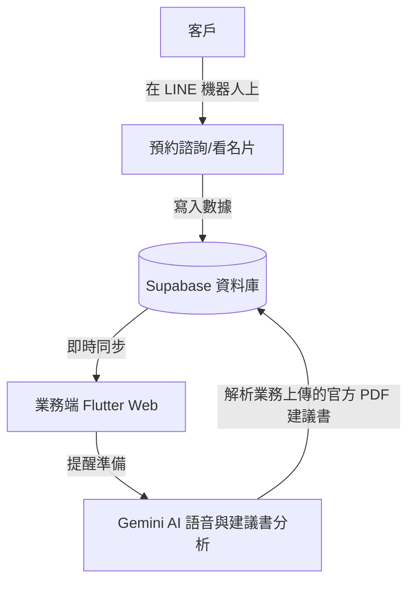

# 20260718 - 產品設計與可行性評估討論筆記

---

## 🙋‍♂️ 開發者原始想法與疑問 (Question)

> 「我的想法是若是站在一個業務的身分，若已跟客戶做接洽，那我一定會想要讓客戶在需要我的時候能第一時間找到我，但考慮到現在我們做的是以網站為主（當然 APP 也行但目前會牽扯到上架，上架需要費用那會違背預算的部分盡量做的一切都不要花到錢）。
>
> 然而我反而想到能夠做一個 LINE 的聊天機器人，在其中就能塞入我的基本資訊、還能夠預約的時間？（這我就不確定隱患、實用性）也能連接到公司的網站，甚至還能不能再做到什麼？我腦袋目前東西還想不到。所以想來聊一下評估以及跟我們目前、未來的專題結合能有什麼化學反應？
>
> 加上我們目前網站是有做到一個叫『數據戰情』的地方，像這邊又能顯示出多少資訊？
>
> 因為若是做查詢保險資訊的已經有了，我也不覺得那是我們現在要做的方向，那我們又該怎麼解決這個會需要保險資訊的問題？打配合的嗎？（就是配合別人的網站）這樣是爬蟲嗎？又或是不穩定？這件事的建議又會是什麼？再來若是保經公司她們應該能查詢到？那像是之前有跟前輩聊過他是說現在的保險雖然還是會需要跟客戶要他抱過的年份，那可以做到相對的保險查詢，那如果是要幫他做新的加保，那他們也是有工具可以做到去抓不同保險公司最新的資訊，但他們還是會習慣要去到各個保險公司的平臺再去做 2 度的確認，這個是我之前有聽說過，那這邊會使我們有機會優化的地方？還是它的困難點也是擺在那邊會需要去克服？又或者是我們有辦法用其他繞道的方式得到一樣的結果嗎？」

---

## 💡 AI 評估與回覆 (Answer)

### 1. LINE 機器人（客戶端）與 Flutter 網站（業務端）的整合評估
* **實用性評估**：
  * **極高**。在台灣，App 的下載門檻和上架成本（App Store 帳號年費）對獨立業務員而言太高。而 LINE 是幾乎 100% 滲透的管道，適合做為客戶免安裝的入口。
  * **功能串接**：可用 LINE 機器人的圖文選單（Rich Menu）顯示業務員電子名片，並透過 LINE 視窗內開啟輕量網頁（LIFF 網頁）來進行「線上預約」。
* **隱患與對策**：
  * **隱患 A：時間衝突（Double Booking）**
    * *對策*：LIFF 預約網頁載入時，直接讀取 Supabase 中的 `reminders`（日程表），並結合業務員 Google 日曆，在前端自動遮蔽已佔用時段，只開放可預約時段。
  * **隱患 B：LINE 訊息推播費用**
    * *對策*：多利用 LIFF 網頁進行互動（免費），僅在關鍵通知（如預約成功、改期）時發送 LINE Message，降低訊息發送費用。

---

### 2. 「數據戰情」看板的功能發想
我們目前的 Web 主畫面包含「數據戰情」區塊，在未來可以規劃為提供業務員**「行動指引」的戰情室**，顯示以下指標：
* **維繫溫度計**：自動計算並列出超過 30/60/90 天未互動的客戶，警告業務員今天該主動傳訊聯絡。
* **需求熱力圖**：統計所有客戶標籤（如：醫療險需求、高資產、新生兒），呈現近期主力推廣方向。
* **轉換漏斗**：呈現「本週預約中」➡️「已面談」➡️「簽約成交」的比例，協助業務員發現自身業績瓶頸。
* **AI 備忘精華**：利用 Gemini 語意分析近期語音備忘錄，提煉出「本周待辦 Top 3」。

---

### 3. 保險資訊查詢痛點與「二度確認習慣」之繞道方案
* **行業痛點分析**：
  * 業務員之所以在用過查詢工具後，仍習慣去保險公司官網平台進行「二度確認」，是因為**合規性與責任歸屬**。保費、條款、核保規則隨時在變，一旦報錯價格或條款，業務員需承擔專業疏失與理賠糾紛。
  * **不建議硬做爬蟲**：爬蟲去爬各官網極度不穩定，常因網站改版或防爬蟲（Captcha/封鎖 IP）而失效，且維護全險種資料庫的合規與工程成本極高。
* **推薦繞道解決方案**：
  * **方案 A（一鍵直達 Deep Linking）**：
    系統不直接儲存複雜的條款，而是在客戶卡片中直接提供該險種官方的**直達連結**，省去業務員手動 Google 搜尋與在官網迷路的時間，加速其二度確認的過程。
  * **方案 B（AI 建議書解析 PDF Parser）**：
    業務員在官方算好、二度確認無誤後下載的 **PDF 建議書**，直接上傳至系統。我們透過 **Gemini API** 進行建議書解析（OCR），自動提煉出保額、保費、保障項目等，自動寫入該客戶的 Supabase Profile。**這完美繞過了爬蟲的不穩定性，幫業務員省去手動登錄資料的痛苦。**

---

## 🎨 專案生態系架構圖 (Mermaid Diagram)

