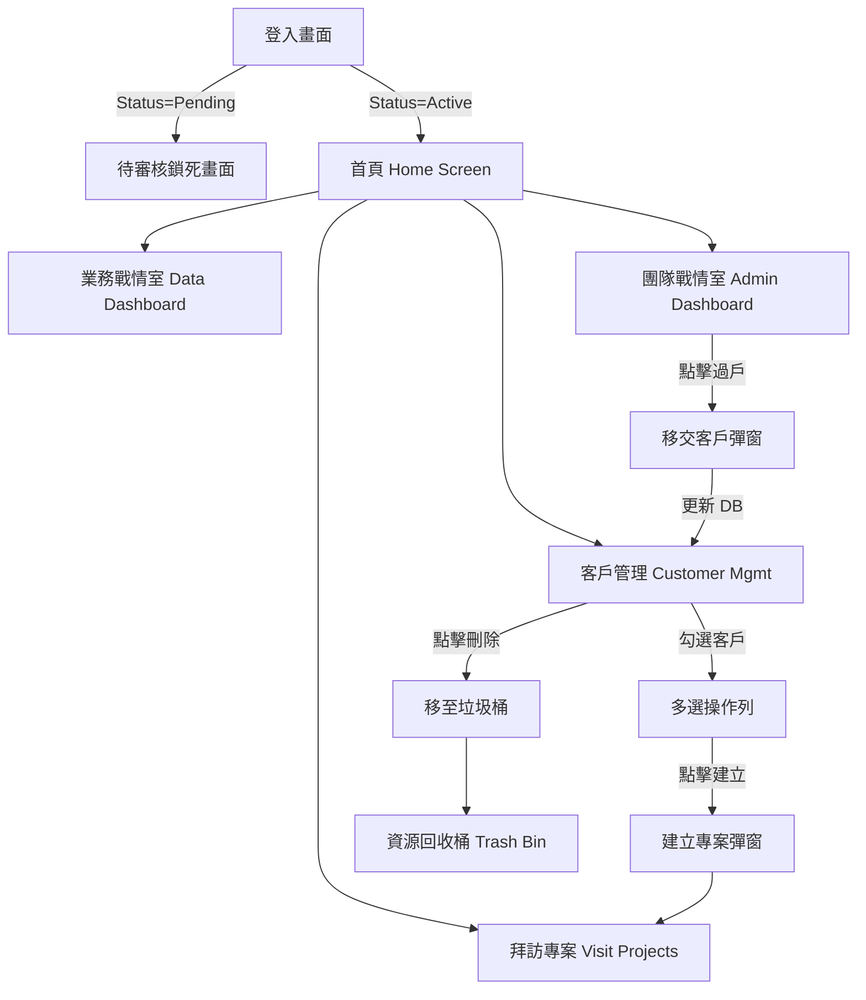

# 🗺️ insurance_helper 專案全景地圖 (SSOT)
*(Last Updated: 2026-08-18, CRM Dev 視角切換器、資料庫業務員關聯與標籤觸發器修復版)*

> **架構師與審查員共同備註**：本文件為全專案的**單一真理來源 (Single Source of Truth)**。已完成 100% 的前端組件、後端關聯、錯誤防呆與畫面動線解析。開發任何新功能前，必須嚴格依照此地圖進行「雙向連動影響評估」。

---

## 0. 💾 系統底層結構 (Database & State Management)

### A. 實體資料表結構 (Supabase Tables)
- **`profiles`** (人員/業務員)：`id` (PK), `email`, `full_name`, `avatar_url`, `role` (`agent`, `admin`, `dev`), `status` (`active`, `pending`, `deleted`, `suspended`), `team_id`, `team_name`, `is_google_connected`, `connected_providers`, `phone`, `company`, `job_title`, `website`, `address`, `bio`
  - **🛡️ 安全加固 (2026-08-18)**：已掛載 `prevent_unprivileged_profile_security_changes` Trigger，一般業務員嚴禁竄改 `role`, `status`, `team_id`, `team_name`。
- **`customers`** (客戶)：`id` (PK), `profile_id` (FK), `name`, `nickname`, `phone`, `email`, `tags` (Array), `notes`, `custom_attributes` (JSONB 動態自訂屬性袋), `deleted_at`, `referral_source_id` (FK 介紹人)
  - **🛡️ 業務員動態關聯 (2026-08-18)**：前端跨表查詢 `profiles` 即時帶出建檔業務員姓名與信箱；支援 Dev 專屬「僅我建立 / 全系統客戶」視角切換。
  - **🌟 無損雙向往返 (Round-Trip 2026-08-22)**：自訂欄位結構化保留於 `custom_attributes`，匯出/匯入支援表頭前綴可逆還原，全面具備 Formula Injection、XSS、vCard RFC 2426 折行防護。
- **`customer_policies`** (已投保單關聯)：`id` (PK), `customer_id` (FK), `policy_clause_id` (FK), `room_limit`, `surgery_limit`, `misc_limit`, `benefits_json`, `enrolled_at`
  - **🛡️ 安全加固 (2026-08-18)**：已全面清除 anon/authenticated 全開 Policy，強制綁定客戶擁有者與 admin/dev 權限。
- **`policy_clauses`** (全台條款庫存 11,722 筆)：`id` (PK), `product_name`, `company_name`, `category`, `benefits_json`, `raw_pdf_url`, `crawled_at`
  - **🛡️ 安全加固 (2026-08-18)**：全團隊登入者唯讀，寫入僅限 admin/dev 及 Edge Function Service Role Key。
- **`customer_relationships`** (人脈網路)：`id` (PK), `user_id`, `source_customer_id`, `target_customer_id`, `relationship_type` (Enum), `relationship_detail`
- **`visit_projects`** (拜訪專案)：`id` (PK), `profile_id` (FK), `title`, `purpose` 
  - **⚠️ 隱患：缺乏 ON DELETE CASCADE**。
- **`visit_project_customers`** (專案關聯客戶)：`id` (PK), `visit_project_id` (FK), `customer_id` (FK), `is_visited`
- **`tag_categories`** (標籤分類字典)：`id` (PK), `name`, `color_code` (全團隊唯讀，管理限 admin/dev)
- **`tags`** (標籤庫)：`id` (PK), `category_id` (FK), `name` (全團隊唯讀，掛載 UNIQUE name 約束，管理限 admin/dev)
- **`customer_tags`** (客戶標籤多對多)：`customer_id` (FK), `tag_id` (FK) (受 `sync_customer_tags` Trigger 安全雙軌同步)
- **`news_rss_sources`** (保險新聞 RSS 來源)：`id` (PK), `name`, `feed_url`, `category`, `is_active` (全團隊唯讀，管理限 admin/dev)
- **`insurance_news_topics` & `insurance_news_articles`** (新聞聚類與報導)：全團隊唯讀，管理限 admin/dev。
- **`schedule_events`** (日曆行程)：`id` (PK), `profile_id` (FK), `start_at`, `end_at`, `title`, `location`, `latitude`, `longitude` (具備經緯度合法值域檢查)

### B. 雲端存儲空間與 Edge Functions 安全 (Supabase Storage & Functions)
- **`avatars`** (業務員頭像 Bucket)
- **`customer-photos`** (客戶頭像 Bucket)
- **`crawl-insurance-products`**：雙軌驗證 (`x-crawler-secret: $CRAWLER_CRON_SECRET` / `insurance_helper_cron_secret` + Admin JWT)，包含全套跨網域 CORS Header 與 OPTIONS 預檢，強制使用 Service Role Key 寫入 `policy_clauses`，未授權立即 401 攔截。
- **`transcribe-voice` & `voice-scheduler`**：啟用 `verify_jwt: true` 嚴格防止外部盜刷與配額浪費。
- **`fetch-insurance-news`**：每日 06:00 與 18:00 自動抓取多源 RSS 並透過 Groq AI 聚類；具備 Groq Auto-Discovery 動態探索自我修復機制，當預設 LLM 模型失效時自動探測 /v1/models 替換。
- **🎙️ 全域語音防護協定 (2026-08-20)**：
  - **模式一（今日行程）**：建立非當日行程時保留 `_selectedDate` 視角不強制切換，以 Toast 引導跳轉；離線時自動安全攔截。
  - **模式二（客戶備註/抽屜）**：強制採用 `--- 🎙️ YYYY/MM/DD HH:mm 語音速記 ---` 時間戳追加（Append Only），嚴禁覆蓋既有筆記；標籤提取嚴格限制於現有標籤庫，嚴禁寫入髒標籤。

### C. 全域同步與離線策略 (Offline Sync Strategy)
- 系統採 **Offline-First (離線優先)** 架構，使用 `OfflineDataStore` 與 `SharedPreferences`。

---

## 1. 🔑 驗證與防護門模組 (Auth & Status Gate)
- **按鈕：[Email 註冊]** -> 移除姓名自動預填，密碼具備眼睛防窺切換，註冊成功彈窗提供「前往收件匣 (開啟信箱)」快速跳轉。
- **按鈕：[Google 登入]** -> **(⚠️ 隱患：跳過填寫 team_code，會產生幽靈帳號)**。
- **秘密手勢：[盾牌 5 連擊秘密真實登入 (方式 B)]** -> 藍綠色盾牌 Logo 1.8 秒內連點 5 下，自動以真實 Demo 業務員「牛來 (`niulai@helper.tw`, 成都團隊, `role: agent`)」向 Supabase 進行 `signInWithPassword` 真實身分認證登入，取得完整 Session JWT 轉跳首頁。離線時自動防護降級。
- **忘記密碼流程 (Password Recovery)** -> 信件連結點擊後導向獨立全螢幕 `ResetPasswordScreen`，強制要求輸入新密碼，更新成功後立即銷毀臨時 Session 並強制登出，要求回登入頁親自手動輸入。
- **【Pending (待審核)】狀態**：強制路由至 `PendingApprovalScreen`。
- **【Active (已啟用)】狀態**：允許進入首頁。受 Dev 控制台的「免審核開關」全局影響。
- **【Deleted (已軟刪除)】狀態**：使用者提出刪除後進入待清理狀態，等待開發者於控制台進行 Hard Delete 實體清除。

---

## 2. 📱 核心業務動線 (User Flow & Routing)

---

## 3. 🖥️ 核心畫面組件級解析 (Pixel-Perfect UI)

### A. 業務戰情與分析 (`data_dashboard_tab.dart`)
- **圖表/指標**：本月個人拜訪數、VIP 客戶數、保單健診完成率。
- **表單/彈窗：[理賠試算]** -> 包含保單下拉選單，與四組滑桿。
- **表單/彈窗：[保費估算]** -> 包含性別 ChoiceChip、年齡滑桿 (18-65)。
- **操作：[商品過濾與比較]** -> 勾選至多 4 筆後開啟比較表。

### B. 主管團隊戰情室 (`admin_dashboard_tab.dart`)
- **開關：[視圖切換器]** -> 在 `👑 團隊管理視圖` 與 `💼 個人業務視圖` 間切換。
- **按鈕：[開通帳號]** -> 針對 Pending 成員，更新 DB 為 Active。
- **按鈕/表單：[過戶]** -> 針對旗下業務的客戶，變更客戶擁有權。

### C. 客戶管理與拓撲 (`customer_management_tab.dart` / `relationship_topology.dart`)
- **[客戶全景側邊抽屜 Side Sheet]** -> 520px 沉浸式讀寫合一抽屜（基本資料、11,722 筆條款庫 8 筆動態條件分頁平滑搜尋、已投保單儲存於 `customer_policies` 實體表且預設 0 假資料、0 成本精算、拜訪歷程內嵌錄音、草稿一鍵轉正）。
- **[待補齊草稿收件匣]** -> 頂部金黃色收件匣卡片，篩選 `status = draft`，一鍵補齊轉正。
- **[資源回收桶 Trash Bin]** -> `TrashCategory` 多維可擴展分類（`[全部]`、`[正式客戶]`、`[語音草稿]`、`[行程]`），支援草稿專屬還原防手滑。
- **[人脈拓撲網狀圖]** -> 1600x1000 質心自適應置中畫布，三軌道避障弧線 (+85px/0/-85px) 徹底解決標籤重疊，過濾 `deleted_at IS NULL`，孤立節點均勻外環排列，拖曳座標持久化快取。

### D. 拜訪專案與行程 (`visit_projects_tab.dart` / `schedule_tab.dart`)
- **[拜訪專案清單]** -> 具備展開/收合客戶核取清單的功能。
- **⚠️ 系統盲區警告 (行程管理開發中)** -> `schedule_tab.dart` 目前僅為畫面佔位符。
- **按鈕：[刪除專案]** -> 彈出 AlertDialog 進行防呆確認。

### E. 系統設定與開發控制台 (`settings_screen.dart` / `dev_console_screen.dart`)
- **[設定頁]**：頂部 Cloud Sync Banner，主題色切換，客戶檢視模式切換，底部新增【刪除帳號 (Soft Delete)】入口。
- **[控制台] ChoiceChip**：點選 (Agent / Admin / Dev) 瞬間改變介面渲染邏輯。
- **[控制台] 用戶資料清理**：列出所有 `status = deleted` 帳號並提供【徹底刪除 (Hard Delete)】按鈕。
- **[控制台] 按鈕**：觸發新聞爬蟲、注入/清空 10 筆沙盒測試資料。
- **[控制台] AI 語音引擎**：測試 Whisper STT Edge Function。
  - **⚠️ 成本防護盲區**：缺乏 Edge Function 的 Rate Limit，有被惡意攻擊刷爆 OpenAI 帳單的風險。

---

## 4. 🚀 【未來藍圖區】企業級架構預備 (To-Be)

除了先前提出的邀請碼、全域稽核日誌、在線綠點外，為確保系統可承受十萬級別使用者，必須補足以下企業級地基：

1. **多對多標籤重構**：消滅 Array 造成的 `mergeTags` OOM 危機。
2. **雙向拓撲防護網**：DB 自動補全雙向關聯，前端加入防無限迴圈演算法。
3. **本地加密資料庫**：將 CRM 快取升級為 AES-256 加密層，防堵設備遺失個資外洩。
4. **離線同步衝突處理**：實作 LWW (最後寫入者贏) 的 Timestamp 比對機制。
5. **無限滾動分頁 (Pagination)**：客戶與專案列表強制導入分頁載入，保護前端記憶體。
6. **Token Expiration 攔截器**：離線狀態下捕捉 401 錯誤，轉入優雅的唯讀模式。
7. **Storage RLS 與容量鎖**：圖片上傳強制鎖定 5MB 且限定同團隊 Token 存取。
8. **Edge Function 流量清洗 (Rate Limit)**：為所有 AI/爬蟲 API 上鎖，防堵帳單攻擊。
9. **深層連結路由 (Deep Linking)**：導入 GoRouter，為未來的推播跳轉鋪路。
10. **日誌分區歸檔 (Log Partitioning)**：`audit_logs` 日誌表必須設定 `pg_cron`，超過 90 天自動封存至冷資料庫，避免佔用活躍資料庫的 RAM。
