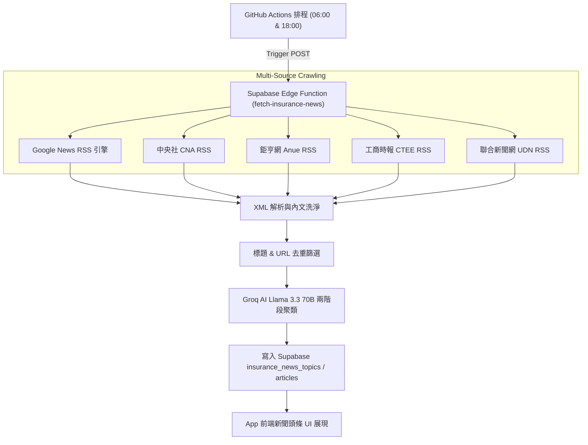

# 📄 台灣保險與金融新聞多源 RSS 來源整合報告 (System RSS Source Specification)

> **文件版本**：v1.0  
> **建立日期**：2026-08-06  
> **歸屬模組**：【模組五：系統個性化、情報與多國語系】Phase 7 新聞頭條與 AI 聚類系統  
> **技術負責人**：巨獸 (beast) 🦖

---

## 🎯 一、設計理念與架構 (Dual-Track Aggregation Architecture)

為了確保業務員每日獲得最全面、權威且即時的金融保險情報，本系統採用 **「雙軌混合 RSS 抓取與 Groq AI 聚類機制」**：

1. **軌道一：Google News 全網主題搜尋引擎 RSS (Wide-Coverage Engine)**：
   - 透過關鍵字檢索全網近百家新聞媒體（含《經濟日報》、《工商時報》、《鏡週刊》、《自由時報》、《Yahoo新聞》等），確保不漏接重大突發新聞。
2. **軌道二：權威機構與財經媒體原生 RSS (Authoritative Direct Feeds)**：
   - 直接對接中央通訊社、鉅亨網、工商時報、聯合新聞網等第一線權威新聞發布點，獲取高品質、無二次加工的原生報導。
3. **Groq Llama 3.3 70B 自動去重與聚類 (AI Clustering & Deduplication)**：
   - 後端 Edge Function 抓取所有 RSS XML 後，先進行標題與 URL 洗淨，再由 Groq AI 以語意相似度將跨媒體新聞歸納於同一話題卡片下，並自動提煉單段重點摘要。

---

## 📊 二、已整合之 RSS 頻道明細清單 (Active RSS Channels)

目前後端 Supabase Edge Function `fetch-insurance-news` 已正式串接以下 7 大 RSS 頻道：

| 序號 | 媒體 / 機構名稱 | 頻道類別 | 原生 RSS 網址 (Feed URL) | 更新頻率 | 資訊權威度與優勢 |
| :---: | :--- | :--- | :--- | :---: | :--- |
| **1** | **Google News 保險主題** | 全網新聞聚合 | `https://news.google.com/rss/search?q=保險+OR+壽險+OR+產險&hl=zh-TW` | 即時 (Realtime) | 廣泛覆蓋全台大少媒體報導 |
| **2** | **Google News 金管會保險局** | 政策監管專題 | `https://news.google.com/rss/search?q=金管會+保險局&hl=zh-TW` | 即時 (Realtime) | 鎖定金管會最新修法與監管細則 |
| **3** | **Google News 保險公會** | 產業公會專題 | `https://news.google.com/rss/search?q=金融+保險公會&hl=zh-TW` | 即時 (Realtime) | 掌握壽險公會與產險公會配套指引 |
| **4** | **中央通訊社 (CNA)** | 國家權威財經 | `https://www.cna.com.tw/cna2010/market/rss.xml` | 每小時 | 台灣國家級通訊社，具備最高公信力 |
| **5** | **鉅亨網 (Anue)** | 台灣總體經濟 | `https://news.cnyes.com/rss/pref/news/cat/tw_macro` | 即時 (Realtime) | 深度解析金融金控財報與資本結構 |
| **6** | **工商時報 (CTEE)** | 產經理財專題 | `https://ctee.com.tw/feed` | 每日更 | 深入報導壽險業商品策略與商品轉型 |
| **7** | **聯合新聞網 (UDN)** | 理財與生活保險 | `https://udn.com/rss/news/2/6645` | 即時 (Realtime) | 貼近保戶生活、醫療險與理賠實務議題 |

---

## ⚙️ 三、Edge Function 自動化抓取與處理流程

---

## 🚀 四、未來擴充與維護指引 (Extensibility Guide)

若未來需新增更多專業機構（如 *保險事業發展中心 TII*、*財政部賦稅署* 或 *現代保險新聞網 RMIM*）之 RSS 來源，請依照以下步驟維護：

1. **修改 Edge Function 頻道清單**：
   編輯 [supabase/functions/fetch-insurance-news/index.ts](file:///c:/GitHub/project67/supabase/functions/fetch-insurance-news/index.ts) 中的 `rssUrls` 陣列，直接加入新頻道的 RSS XML URL。
2. **部署 Edge Function**：
   執行 `npx supabase functions deploy fetch-insurance-news --no-verify-jwt` 完成部署。
3. **更新本專題報告文件**：
   同步補充本檔之「二、已整合之 RSS 頻道明細清單」表格，維護技術文檔一致性。
