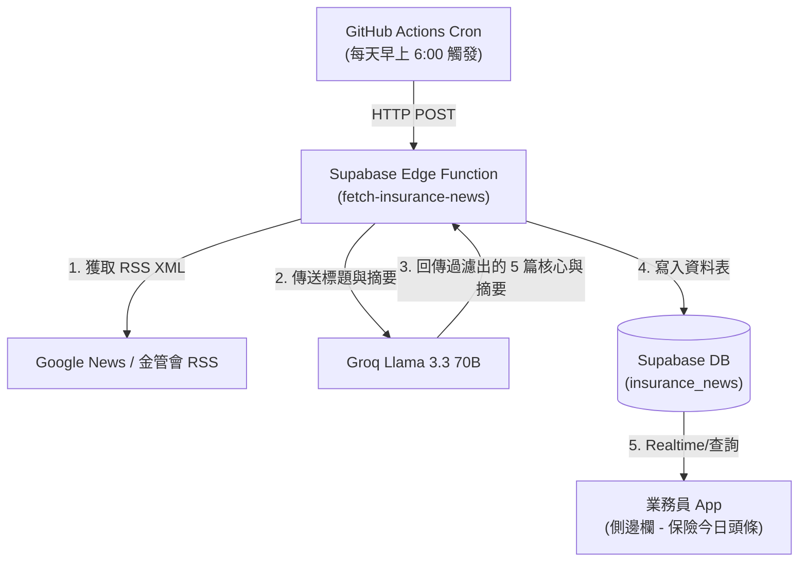

# 📰 每日保險新聞自動推送方案 (Daily Insurance News Auto-Push Proposal)

本文件針對 Phase 7 的「每日保險新聞與權威產業動態 AI 自動整理系統」進行架構與技術方案評估，解答新聞來源、篩選標準、AI 算力成本（Token 消耗）以及工作流工具（n8n vs GitHub Actions） the 選擇。本方案已確定**捨棄其他 API（如 Gemini），完全採用 Groq 平台**作為新聞處理的大腦。

---

## 1. 新聞來源從哪裡來？ (News Sources)

保險代理人需要的是**即時性高、具權威性、且與法規/險種高度相關**的金融保險資訊。建議採取 **「RSS 訂閱源 + 搜尋聚合」** 的輕量級爬取方案：

1.  **Google 新聞 RSS 聚合服務 (最推薦，免 Key、免費且極為穩定)**：
    *   利用 Google News 的 RSS 搜尋特定關鍵字（如：`保險`、`壽險`、`產險`、`金管會保險局`）。
    *   *網址範例*：`https://news.google.com/rss/search?q=保險+OR+壽險+OR+產險+site:tw&hl=zh-TW&gl=TW`
    *   這會返回一個乾淨的 XML 格式文件，直接包含新聞標題、來源媒體、原始連結與發布時間，不需寫複雜的 HTML 爬蟲。
2.  **官方新聞稿源**：
    *   **金管會保險局公告**：直接抓取保險局新聞稿 RSS。這是政策、罰單、法規變更的第一手來源，對業務員最重要。
3.  **財經主流媒體專區**：
    *   經濟日報保險專區、工商時報金融專區、鉅亨網保險專區等 RSS 頻道。

---

## 2. 如何判斷哪些新聞要播報？ (Curation Criteria)

AI 大腦會根據以下規則進行過濾與篩選，確保業務員每天只需花 3 分鐘就能掌握核心，不被垃圾資訊轟炸：

*   **🟢 必須播報（高度相關）**：
    1.  **法規政策變動**：如基本利率調整、醫療險示範條款修改、實支實付新制上路等。
    2.  **新型產品趨勢**：如各家開始力推長照險、綠色保險、外送員專屬保險等。
    3.  **社會熱點與風險意識**：如大型天災（地震、颱風）引發的理賠與防災議題、健保改革政策。
*   **🔴 不予播報（無關或雜訊）**：
    1.  個別公司的股票漲跌、單日業績八卦。
    2.  與保險無直接關聯的全球地緣政治、純科技新知。
    3.  保險公司的業配宣傳文（無實質政策或產品亮點）。

---

## 3. 用 Groq 當大腦，Token 與限制會不會爆掉？ (AI Brain & Token Cost)

**答案：完全不會！Groq 提供的免費額度極為慷慨，使用 Llama 3.3 70B 可達 100% 穩定且完全免費。**

### 💡 成本控制與限制策略：分層過濾法 (Two-Stage Filtering)
為了避免觸發 Groq 的每分鐘 Token 限制 (TPM)，並維持最優的提取精度，我們在 Edge Function 中設計兩階段處理：

1.  **第一階段：標題與摘要篩選（Llama 3.3 70B）**：
    *   將抓取到的 30~50 條 RSS 標題 + 簡短說明（Snippet，每條約 100 字）打包送給 **Llama 3.3 70B**。
    *   *輸入大小*：50 條 $\times$ 150 字 $\approx$ 7,500 字（約 3,000 Tokens）。
    *   *AI 任務*：過濾掉無關新聞，選出最值得業務看的 **5 篇核心新聞**。
2.  **第二階段：全文摘要與觀點提煉（Llama 3.3 70B）**：
    *   僅針對篩選出的這 5 篇核心新聞，下載其網頁全文，傳送給 Llama 3.3 70B。
    *   *AI 任務*：為每篇新聞提煉出 **3 點條列式摘要 (Bullet Points)**，並寫出 **一句話的「業務拜訪切入點」**。
    *   *Token 總消耗*：約 10,000 Tokens。

*   **Groq 限制驗證**：
    *   Groq 對 `llama-3.3-70b-specdec` 的免費額度為 **每分鐘 6,000 Tokens**，**每天 14,400 次請求**。
    *   因為我們每日自動推送**每天只需執行一次**，且分層過濾時每次請求間隔 5 秒（以防觸發 TPM 限制），可以 100% 完美在免費額度內穩定運行，且完全不需管理多個 API 服務。

---

## 4. 有必要用 n8n 嗎？有沒有更有效率的方式？

**結論：沒有必要特地架設 n8n。使用「GitHub Actions + Supabase Edge Functions」是更高效、0 成本且易於維護的治本方案。**

### ⚖️ 工具評估對比

| 維度 | n8n 工作流 | GitHub Actions + Supabase Edge Functions (推薦 ⭐️) |
| :--- | :--- | :--- |
| **主機成本** | 需自行租用伺服器（每月 $5~$10 USD），或使用付費雲端版。 | **0 元**（完全在 GitHub 免費額度與 Supabase 免費額度內）。 |
| **部署與備份**| UI 拖拉配置，版本控制（Git 備份）較為繁瑣，容易因為主機重啟中斷。 | **Code-as-Configuration**。工作流寫在 `.github/workflows/` 中，程式碼在 Edge Function 中，100% 納入 Git 版本控管。 |
| **運作機制** | 定時觸發 n8n 節點執行。 | **GitHub Actions Cron 定時任務** 每天早上 6:00 自動觸發一次 Edge Function，執行爬取、AI 過濾並寫入 Supabase 資料表。 |
| **維護性** | 節點多時容易混亂，排錯需進後台看 Log。 | 程式碼結構清晰，出錯時 GitHub Actions 會自動發送 Email 報警通知開發者。 |

### 🛠️ 推薦的極簡自動化架構

1.  **工作流配置 (`daily-news.yml`)**：
    在專案中建立 `.github/workflows/daily-news.yml`，設定 Cron 每天自動發送一個 cURL 請求觸發我們的 Supabase Edge Function。
2.  **後端函數 (`fetch-insurance-news`)**：
    在 Deno 環境中編寫 Deno Fetch 讀取 RSS，呼叫 Groq API（使用 Llama 3.3 70B）進行 JSON 解析與篩選，並將篩選後的資料直接寫入 Supabase 的 `insurance_news` 資料表中。
3.  **前端展示**：
    手機 App 在載入時，直接從 `insurance_news` 讀取今日最新的 5 條數據，以卡片形式精緻呈現給業務員。
