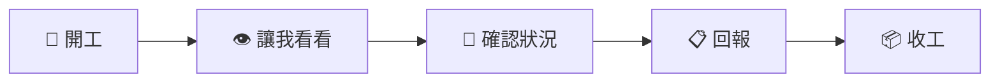

# 🔰 Antigravity 與專案新手入門指南 (Quickstart Guide)

- **作者**：小陳 (chen)
- **建立日期**：2026-09-30
- **適用對象**：第一次接觸本專案（`project67` / `insurance_helper`）與 Antigravity AI 協作環境的新成員
- **關聯手冊**：[開發人員快捷指令](../../00_公共規格/開發人員快捷指令.md) ｜ [開發人員手冊](../../00_公共規格/開發人員手冊.md) ｜ [緊急救援區](../../00_公共規格/緊急救援區.md)

---

## 🎯 前言：為什麼有這份指南？

當你第一次打開 Antigravity 與本專案時，可能會看到終端機權限跳出彈窗、不確定自己能在哪裡寫代碼、或者不知道如何與 AI 助理溝通。

這份指南用最直白的方式，帶你在 **3 分鐘內掌握所有核心必備觀念**，避開所有新手常見的坑！

---

## 🧭 第一步：我是誰？我的地盤在哪裡？

專案由多位核心成員協作，每個人都有專屬的代號與資料夾，避免互相干擾或程式碼衝突：

| 項目 | 你的專屬設定 | 說明 |
| :--- | :--- | :--- |
| **成員代號** | `chen` / **小陳** | 當你在對話中輸入「開工」時，選取此身分即可。 |
| **預設權限** | `dev` | 核心開發者權限，具備完整除錯與開發控制權限。 |
| **Git 分支規範** | `feature/chen-*` | 例如：`feature/chen-login-ui`、`feature/chen-customer-card`。 |
| **你的專屬工作區** | `docs/06_小陳_工作區/` | [查看工作區說明](../README.md) |

### 📁 你的專屬工作區目錄結構
- **`想法存放區/`（你現在的位置）**：
  * 專門存放你的架構構想、功能草稿、會議心得與個人學習筆記。
  * 🛡️ **重要定心丸**：**這是人類成員的私人領地，AI 只會唯讀巡檢，絕對嚴禁擅自修改或刪除裡面的任何筆記！**

---

## 🛡️ 第二步：遇到終端安全彈窗不要慌（5 個選項完全解析）

當 AI 需要在你的電腦終端機（PowerShell）執行指令時，Antigravity 會基於安全考量彈出權限確認視窗：

```text
Allow [指令名稱]?
> 例如：Get-ChildItem -Path "docs" -Recurse -Depth 2
```

### 5 個選項白話解讀：

| 選項 | 原文說明 | 白話意思 | 新手推薦選法 |
| :---: | :--- | :--- | :--- |
| **`1`** | **Yes, allow this time** | **「只准這一次」**：這次讓你跑，下次跑同一個指令還要再問我。 | 🟡 **保守推薦**：第一次不確定指令做什麼時選它最安心。 |
| **`2`** | **Yes, and always allow ... in this conversation** | **「本次對話永遠允許」**：只要在目前的聊天視窗中，這條指令不再問；開新對話還是會問。 | 🟢 適合當前對話正在密集除錯時。 |
| **`3`** | **Yes, and always allow ... in this project** | **「在此專案中永遠允許」**：在這個專案裡，以後無論何時跑這條指令都直接放行。 | 🚀 **最省事推薦**：如果是純讀取指令（如查檔案、查 git 狀態），選 3 最順暢。 |
| **`4`** | **Yes, and always allow ...** | **「全域永遠允許」**：不管在哪個專案、哪個對話，遇到完全相同的這條指令一律直接跑。 | ⚠️ 較為寬鬆，非必要不需選。 |
| **`5`** | **No (tell the agent what to do instead)** | **「不准執行」**：拒絕執行這條指令，並在輸入框告訴 AI 改做其他事。 | 🛑 覺得指令危險或有疑慮時點選。 |

> 💡 **新手判斷法則**：
> - 看到 `Get-ChildItem`、`git status`、`flutter analyze` 這類**純讀取、檢查類指令**，請安心選 **`1`** 或 **`3`**。
> - 看到涉及刪除或覆蓋檔案的指令，先看清楚再決定，或選 **`1`** 逐次把關。

---

## 🗣️ 第三步：與 AI 協作的 5 大通關密語（快捷指令）

你不需要打落落長的需求，只要在對話中打出以下關鍵字，AI 就會自動觸發標準化 SOP：



1. **`開工`**（開始工作）：
   * 檢查 Git 狀態、確認身分、巡檢工作區想法、展示 [進度.md](../../進度.md) 未完成清單，並自動為你建議分支名稱（`feature/chen-*`）。
2. **`讓我看看`**（查看本地網頁預覽）：
   * AI 會在背景啟動預覽伺服器，並提供 [http://localhost:8080](http://localhost:8080) 連結讓你即時點擊看網頁版成果。
3. **`確認狀況`**（安全手煞車）：
   * 寫到一半覺得方向混亂、或懷疑 AI 改錯東西時輸入。AI 會立即**啟動安全凍結（只讀不寫）**，條列當前進度、改了哪些檔案與下一步計畫。
4. **`回報`**（成果驗收）：
   * 功能剛寫完時輸入。AI 會**只讀不寫**產出成果驗收清單、手動操作旅程，以及專門給 AI 找碴的 QA 測試 Prompt。
5. **`收工`**（正式完成並歸檔）：
   * 測試無誤要提交時輸入。AI 會執行 Quality Gate 4 項品質檢查、自動在 `docs/01_開發日誌/` 建立開發日誌、更新進度表、給出可直接貼上 GitHub Desktop 的 Commit 訊息與 PR 指引。

---

## ⚠️ 第四步：新手 3 大安全天條

在開始寫程式之前，請務必牢記以下 3 個團隊鐵律：

1. **`.env` 金鑰絕不進 Git**：
   * 敏感資訊（Supabase URL、API Key、Gemini API Key）不可寫死在程式碼或提交上 GitHub。
   * 請在專案根目錄建立 `.env` 檔案，共用金鑰可向團隊夥伴索取（或查看團隊 Line 記事本）。
2. **嚴禁「敷衍型偷懶/捷徑寫法」**：
   * 不要為了讓畫面上快速看起來有東西，而寫出違背真實商業系統的代碼（例如在業務員個人頁面隨便塞全系統角色切換鈕）。
   * 所有功能與資料庫權限必須符合真實的 RBAC 角色與安全邊界。
3. **卡關或額度爆掉時看救援區**：
   * 若測試時遇到 Gemini API 429（額度耗盡）或本機環境崩潰，請直接查閱 [緊急救援區](../../00_公共規格/緊急救援區.md) 按照自救 SOP 處理。

---

## 🚀 第五步：準備好了！開始你的第一次開工

當你熟悉以上概念後，你可以按照以下步驟開始你的第一個任務：

- [ ] 1. 確認專案根目錄已有 `.env` 檔案且設定正常。
- [ ] 2. 在對話輸入框中直接輸入 **`開工`**。
- [ ] 3. 在彈出視窗中點選 **我是 小陳 (chen)**。
- [ ] 4. 挑選你想推進的模組任務，按照 AI 的引導建立分支開始開發！
